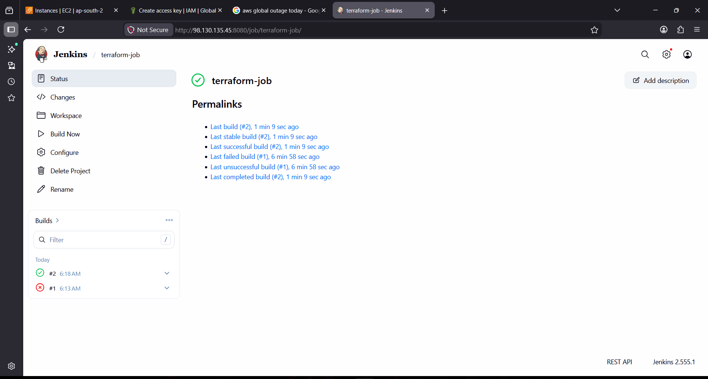
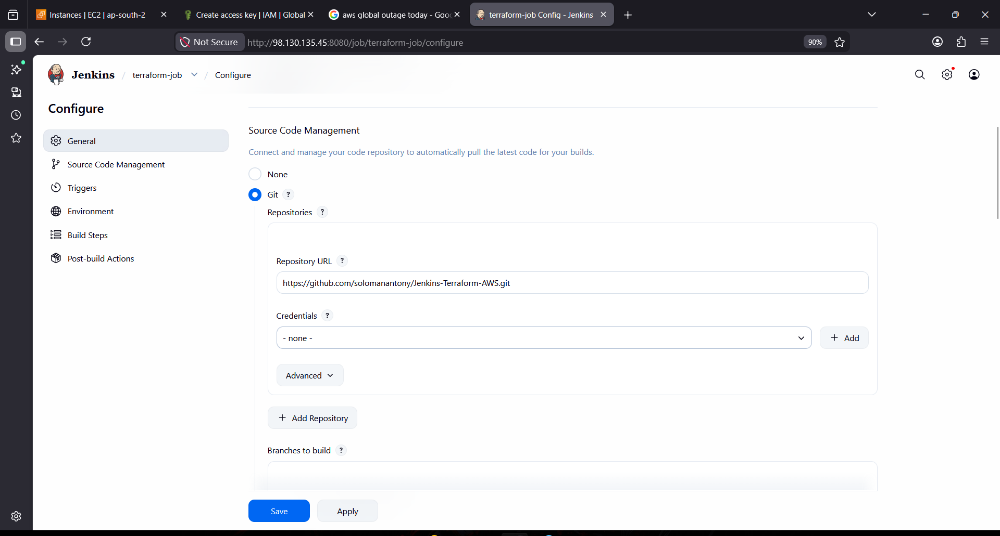
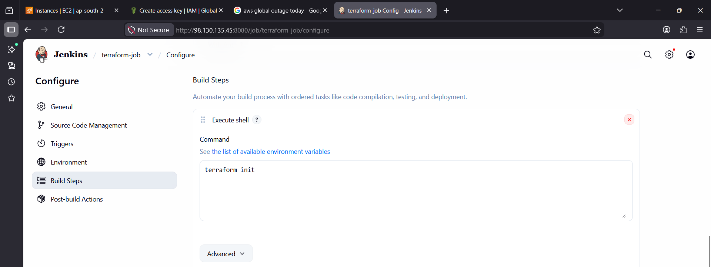
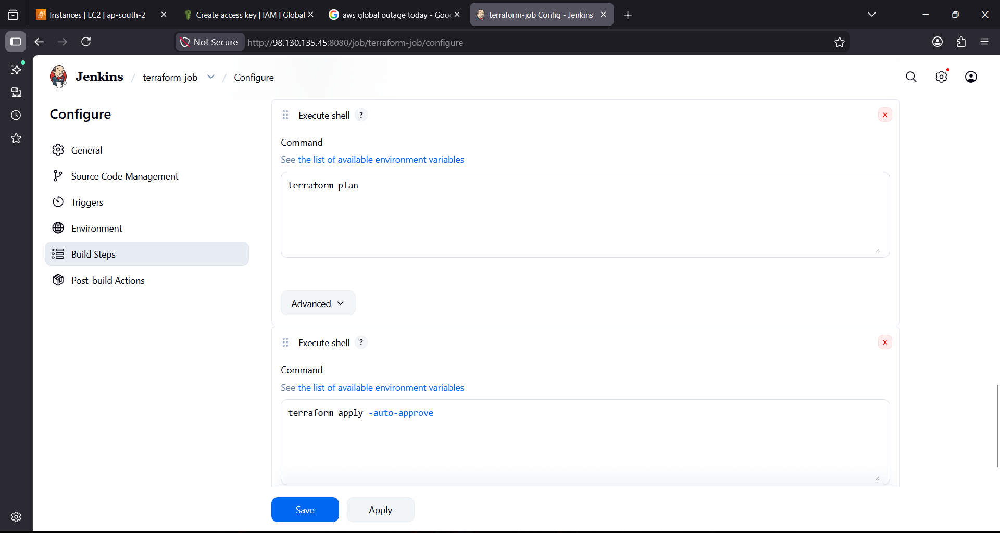
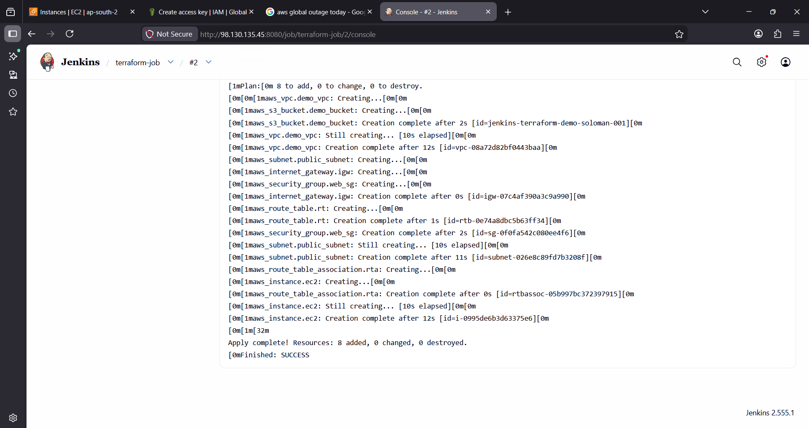
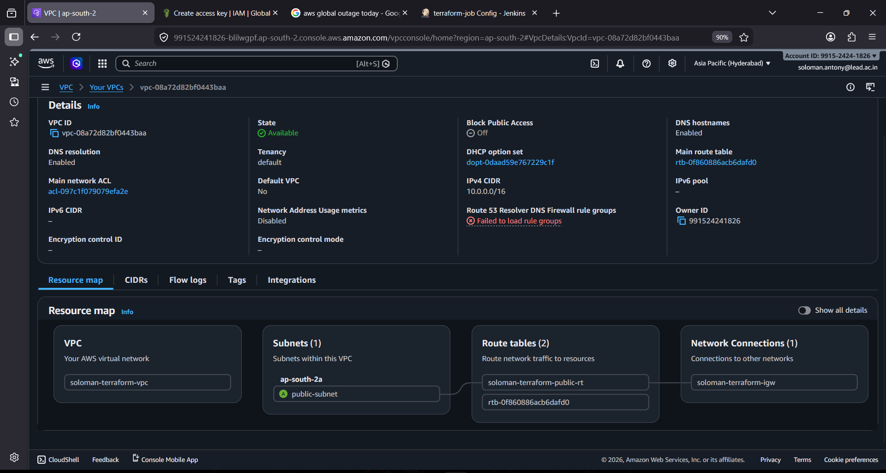
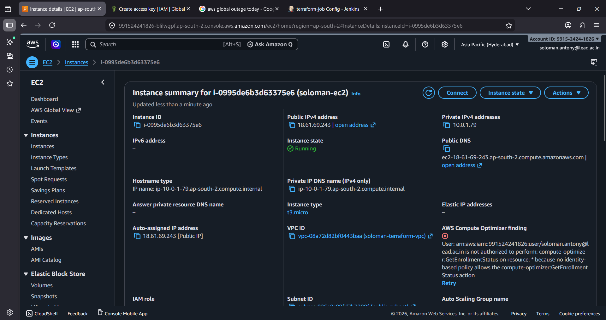
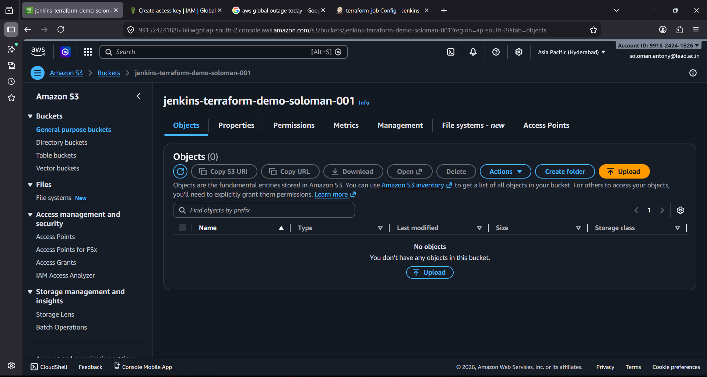

# 🚀 Jenkins + Terraform + AWS Infrastructure Automation

## 📌 Project Overview

This project demonstrates an automated DevOps workflow where infrastructure is provisioned on AWS using Jenkins and Terraform.

Jenkins triggers Terraform to create AWS resources automatically without manual intervention.

---

## 🔁 Architecture

Jenkins → Terraform → AWS (VPC + EC2 + S3)

---

## 🏗️ AWS Services Used

- Amazon VPC – Custom virtual network  
- Amazon EC2 – Compute instance  
- Amazon S3 – Storage bucket  
- AWS IAM – Access and permissions  

---

## 📂 Project Structure

.
├── main.tf  
├── screenshots/  
│   ├── jenkins_overview.png  
│   ├── source_code_setup.png  
│   ├── build_steps1.png  
│   ├── build_steps2.png  
│   ├── build_output.png  
│   ├── vpc.png  
│   ├── ec2.png  
│   ├── s3.png  
└── README.md  

---

## ⚙️ Terraform Configuration

The `main.tf` file defines:

- S3 bucket  
- VPC (with subnet, route table, internet gateway)  
- EC2 instance  

---

## 🖥️ Jenkins Configuration

**Job Type:** Freestyle Project  

**Build Steps:**

terraform init  
terraform plan  
terraform apply -auto-approve  

Jenkins pulls code from GitHub and executes Terraform commands to provision infrastructure.

---

## 🚀 Execution Workflow

1. Jenkins job is triggered  
2. Code is fetched from GitHub  
3. Terraform initializes providers  
4. Terraform plan is generated  
5. Infrastructure is created on AWS  

---

## 📸 Screenshots

### 🔹 Jenkins Job Overview

### 🔹 Source Code Setup

### 🔹 Build Steps
  

### 🔹 Build Output

### 🔹 AWS Infrastructure

#### VPC Resource Map (includes subnet, route table, IGW)

#### EC2 Instance

#### S3 Bucket

---

## ⚠️ Issues Faced & Resolution

**Issue:** Terraform apply failed initially  
**Resolution:**  
- Verified AWS CLI credentials  
- Checked region configuration  
- Fixed Terraform syntax issues  

**Issue:** Resources not visible in AWS  
**Resolution:**  
- Checked Jenkins console output  
- Confirmed successful Terraform execution  
- Verified correct AWS region  

---

## 🎯 Key Learnings

- Infrastructure as Code using Terraform  
- Jenkins automation for provisioning  
- AWS resource creation via automation  
- Terraform workflow (init → plan → apply)  
- Debugging deployment issues  

---

## 👨‍💻 Author

**Soloman Antony**